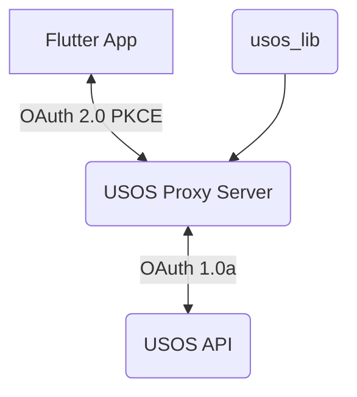

# Studae — Offline-First Student Calendar with USOS Integration

P2P Sync • End-to-End Encryption • Calendar Sharing • Cross-Platform (Mobile & Desktop)

**Studae** is an offline-first, privacy-focused productivity app for students. It offers a unified place to manage deadlines, exams, classes, and personal events — powered by secure peer-to-peer synchronization and optional USOS timetable integration.

## Features

### USOS Integration (Optional)

* Import your university timetable directly from USOS.
* Each external integration (e.g., USOS) is stored as a separate calendar for easy replacement or refresh.

### End-to-End Encryption (E2EE)

* All synced data is encrypted before leaving your device.
* Every device and calendar generates its own **UUIDv4** and **RSA key pair**.
* Signatures are verified during sync, letting you see:

  * who modified an event,
  * which device made the change,
  * and whether the data is trustworthy.

### Peer-to-Peer Synchronization

* Sync devices using **WebRTC**, without relying on the cloud.
* Pair devices by scanning a QR code that contains:

  * the device’s public key,
  * signaling server information.
* Choose whether to sync **all** calendars or only selected ones.

### Calendar Sharing

* Share individual calendars with friends, classmates, or teammates.
* Each shared calendar has its own key pair, so access can be granted or revoked independently.
* Shared calendars provide a visible history of changes with verified signatures.

### Truly Offline-First

* Full functionality works without any internet connection.
* Internet improves integrations and synchronization but is never required for core use.

### Transparency With Signed Changes

When multiple contributors modify a shared calendar, Studae displays:

* which public key created or edited each event,
* the chain of signatures,
* whether every change remains valid.

This ensures complete trust in collaborative or shared calendars.

## Architecture Overview

* Built with **Flutter** for the UI and app experience.
* Uses **WebRTC** for P2P synchronization.
* Stores data locally with strong cryptography for deterministic, secure sync.
* No central data-holding server.
* Integrations (like USOS) operate as independent virtual calendars.

## Core Project Architecture

The project consists of three main components:

1. **Flutter App (`app`)** — The user-facing mobile application.
2. **USOS Proxy Server (`usos_proxy_server`)** — A Rust-based server that handles authentication and translates OAuth2 (from the app) into OAuth1a (required by USOS).
3. **USOS Library (`usos_lib`)** — A shared Rust library containing models and logic for working with the USOS API.



## Technologies Used

* **Frontend:** [Flutter](https://flutter.dev/) (Dart)
* **Backend (Proxy):** [Rust](https://www.rust-lang.org/) with

  * [Axum](https://github.com/tokio-rs/axum)
  * [Tokio](https://tokio.rs/)
* **Integration:** [flutter_rust_bridge](https://github.com/fzyzcjy/flutter_rust_bridge)
* **Environment:** [Nix](https://nixos.org/) + [direnv](https://direnv.net/) for reproducible dev environments

## Project Structure

```tree
.
├── app/                  # Flutter mobile application
├── docs/                 # Project documentation
├── rust/                 # Rust components shared with the Flutter app
├── usos_lib/             # Rust crate with shared USOS API logic and models
├── usos_proxy_server/    # Rust Axum server for OAuth proxying
├── .envrc                # Direnv environment configuration
├── default.nix           # Nix-based development environment setup
└── README.md             # This file
```

## Getting Started

### Prerequisites

* [Flutter SDK](https://docs.flutter.dev/get-started/install)
* [Rust Toolchain](https://www.rust-lang.org/tools/install)
* [Nix Package Manager](https://nixos.org/download.html)
* [direnv](https://direnv.net/docs/installation.html)

### Installation & Running

1. **Load the Nix development environment (via direnv):**

   ```bash
   direnv allow
   ```

2. **Run the USOS Proxy Server:**

   ```bash
   cargo run -p usos_proxy_server
   ```

   Defaults to `127.0.0.1:3000` unless changed in configuration.

3. **Run the Flutter App:**

   ```bash
   flutter run
   ```

   Make sure a simulator or physical device is connected.

## Testing

### Flutter Tests

```bash
flutter test
```

### Rust Tests

```bash
cargo test --all
```

## License

This project is licensed under the MIT License. See the [LICENSE](LICENSE) file for details.
