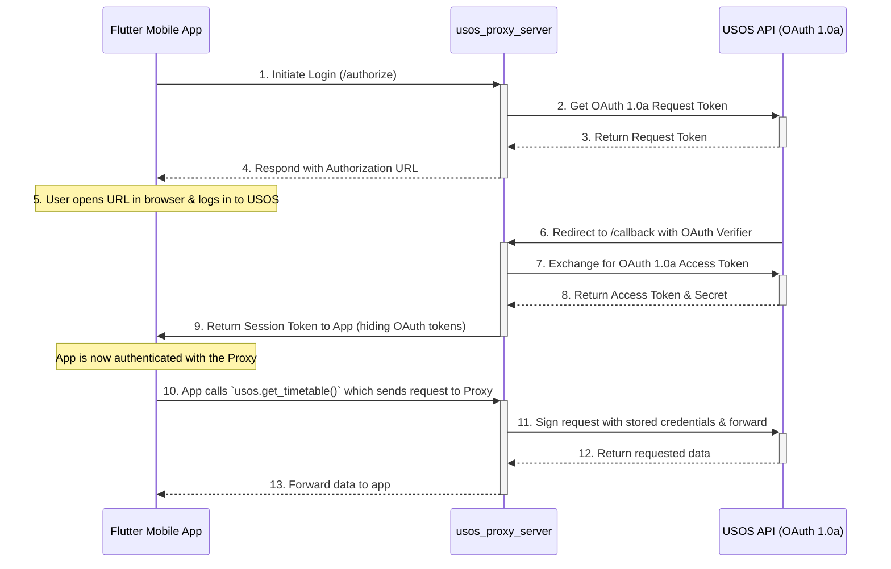

# System Architecture

The Studae project follows a modern mobile app architecture with a backend-for-frontend (BFF) pattern. The key challenge is bridging the gap between the modern authentication used by the app (OAuth 2.0 with PKCE) and the legacy authentication required by the USOS API (OAuth 1.0a).

A second critical role of the BFF is to act as a secure proxy that keeps the OAuth "consumer secret" completely server-side, preventing it from being exposed in the mobile client.

## **[KEY-CONCEPT]** Architectural Components

The system is composed of three main parts that work in concert:

1. **Flutter Mobile App**: The user's primary interface. Its embedded Rust module uses the `usos_lib` crate to make API calls.
2. **`usos_lib`**: A shared Rust library that provides a high-level `Usos` struct for making API calls. It is configured to use a `ProxyClient`, which directs all its requests to the `usos_proxy_server` instead of the real USOS API.
3. **`usos_proxy_server`**: A Rust-based web server that serves two roles:

* It acts as an authentication broker, translating the app's OAuth 2.0 flow to the USOS API's OAuth 1.0a flow.
* It acts as the secure backend for `usos_lib`'s `ProxyClient`, receiving requests, signing them with the stored credentials, and forwarding them to the actual USOS API.

## **[CRITICAL]** Request Flow Diagram

The following diagram illustrates the full sequence of events, from authentication to making an API call.

### Flow Explanation

1. **Initiation**: The app initiates the login process by calling the `/authorize` endpoint on the `usos_proxy_server`.
2. **OAuth 1.0a Dance**: The proxy server performs the entire multi-step OAuth 1.0a "dance" with the USOS API to obtain an access token and secret.
3. **Session Token**: The proxy server **does not** send the raw OAuth 1.0a token and secret to the app. Instead, it creates its own session token, which it sends back to the app.
4. **Authenticated Calls**: When the app needs to fetch data, its Rust code calls a method on the `Usos` struct from `usos_lib` (e.g., `usos.get_timetable()`).
5. **Proxying**: Because the `Usos` struct is configured with a `ProxyClient`, this method call is translated into an HTTP request to the `usos_proxy_server` (e.g., to a `/query` endpoint).
6. **Signing & Forwarding**: The proxy validates the session token, then uses the stored OAuth 1.0a credentials to sign and forward the request to the actual USOS API.
7. **Response Proxying**: The proxy receives the response from the USOS API and passes it back to the app.

This architecture ensures that the sensitive OAuth "consumer secret" and the user's OAuth access token/secret are never exposed to the client-side application.
